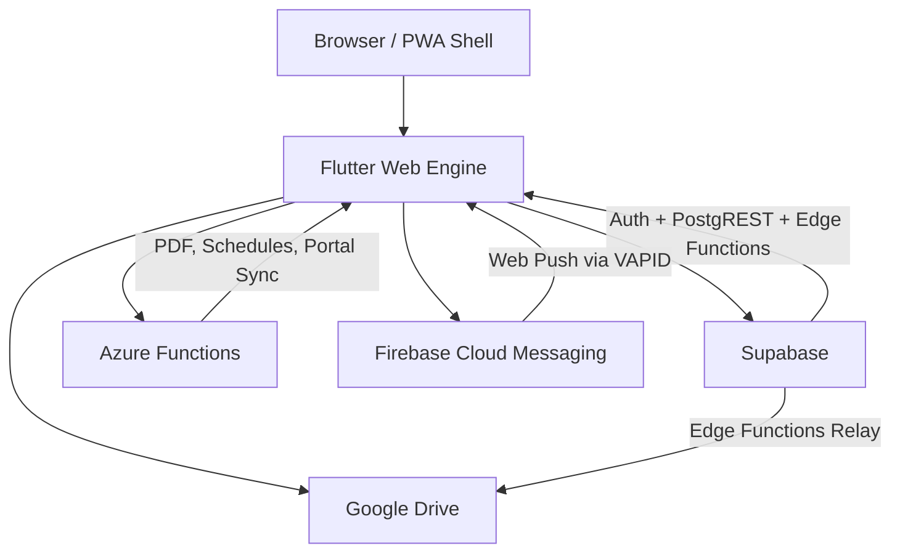

# EWUmate PWA — Progressive Web App

**Subtitle:** Academic Companion for East West University Students (Web/iOS)  
**Deployed at:** [https://app.ewumate.pro.bd](https://app.ewumate.pro.bd)  
**Repository:** `rxxeron/ewumatepwa`  
**Core Technologies:** Flutter Web | Dart 3.x | Supabase | Azure Functions | Service Workers

---

## 2. Table of Contents

1. [Header](#1-header)
2. [Table of Contents](#2-table-of-contents)
3. [What is EWUmate PWA?](#3-what-is-ewumate-pwa)
4. [Architecture Overview](#4-architecture-overview)
5. [Tech Stack](#5-tech-stack)
6. [Project Structure](#6-project-structure)
7. [Web Configuration Files](#7-web-configuration-files)
8. [PWA-Specific Services](#8-pwa-specific-services)
9. [Screen-by-Screen Documentation](#9-screen-by-screen-documentation)
10. [Key Differences: PWA vs Production Build](#10-key-differences-pwa-vs-production-build)
11. [Core Services](#11-core-services)
12. [State Management (Riverpod)](#12-state-management-riverpod)
13. [Data Models](#13-data-models)
14. [Repository Layer](#14-repository-layer)
15. [Backend Integration](#15-backend-integration)
16. [Offline-First Architecture](#16-offline-first-architecture)
17. [Design System](#17-design-system)
18. [Deployment](#18-deployment)
19. [Known Web Compatibility Issues](#19-known-web-compatibility-issues)
20. [Security](#20-security)
21. [Assets & Animations](#21-assets--animations)

---

## 3. What is EWUmate PWA?

EWUmate PWA is the web-adapted version of the native EWUmate mobile application, built using the same robust Flutter codebase. It is designed to run seamlessly within modern web browsers and provides an installable Progressive Web App experience.

**Key highlights include:**
- **Same Flutter Codebase:** Maximizes code reuse, adapting UI components for web paradigms where necessary.
- **Installable PWA:** Can be installed on Android devices via Chrome and on iOS via Safari (Add to Home Screen).
- **Serving iOS Users:** A critical distribution channel for iOS users who cannot access the app via the Google Play Store or where an App Store release is pending/unavailable.
- **Offline Capability:** Fully functional offline experience powered by advanced Service Workers, caching strategies, and local Hive databases.
- **Clean URL Routing:** Utilizes a custom URL strategy configuration to eliminate hash fragments (`#`) from URLs, providing a clean, standard web navigation experience.

---

## 4. Architecture Overview

The system relies on a scalable, offline-first architecture connecting the Flutter Web Engine with various backend and edge services.



---

## 5. Tech Stack

| Layer | Technology | Purpose |
| :--- | :--- | :--- |
| **Frontend Framework** | Flutter Web, Riverpod, GoRouter | Core application logic, reactive state management, and URL-based routing. |
| **Web APIs** | Service Workers, Web VAPID Push, `dart:js_interop` | PWA installation, offline capabilities, push notifications, and DOM bridging. |
| **Integrations** | Firebase Messaging SW, Supabase Flutter | Push notifications integration and backend BaaS connectivity. |
| **UI & Styling** | Google Fonts (Sora), Lottie Web | Premium typography and high-performance vector animations for the web. |
| **Web Adaptations** | Conditional Imports | Platform-specific implementations (e.g., Web-safe PDF saving via Blob, URL strategy). |

---

## 6. Project Structure

The structure emphasizes modularity and feature-based separation, ensuring the PWA remains maintainable alongside the native build.

```text
lib/
├── main.dart
├── firebase_options.dart
├── core/
│   ├── config/ 
│   │   ├── supabase_config.dart
│   │   ├── url_strategy_config.dart
│   │   └── url_strategy_config_web.dart
│   ├── constants/ 
│   │   └── onboarding_steps.dart
│   ├── models/ 
│   │   ├── ... (22 core models)
│   │   └── view_models/ (8 view models)
│   ├── providers/ 
│   │   └── ... (6 base providers)
│   ├── repositories/ 
│   │   └── ... (13 repositories)
│   ├── router/ 
│   │   └── app_router.dart
│   ├── services/ 
│   │   ├── pwa_service.dart
│   │   ├── update_service.dart
│   │   └── ... (8 other services)
│   ├── theme/ 
│   │   ├── app_colors.dart
│   │   ├── app_theme.dart
│   │   └── ewu_theme_extension.dart
│   ├── utils/ 
│   │   ├── pdf_saver_web.dart
│   │   ├── pdf_saver_mobile.dart
│   │   ├── pdf_saver_stub.dart
│   │   └── ... (10 other utilities)
│   └── widgets/ 
│       ├── glass_kit.dart
│       ├── sky_animation.dart
│       ├── animated_progress_ring.dart
│       └── ... (core UI widgets)
└── features/ 
    ├── auth/
    ├── dashboard/
    ├── schedule/
    ├── progress/
    ├── tasks/
    ├── advising/
    ├── directory/
    ├── portal_sync/
    ├── study_vault/
    ├── profile/
    └── ... (17 feature modules in total)
```

---

## 7. Web Configuration Files

### 7.1 index.html
The entry point for the PWA, bridging HTML/JS and the Flutter Web Engine.
- **Meta Tags & Theme:** Defines viewport scaling and theme color (`#0F172A`).
- **Google Sign-In:** Injects the Google Sign-In client ID for web OAuth flows.
- **iOS Enhancements:** Includes `apple-mobile-web-app-capable` meta tags and startup splash image links.
- **PWA JavaScript Bridge:**
  - Listens to `beforeinstallprompt`, storing the event in `window.deferredPrompt`.
  - Listens to `appinstalled` to update UI states.
  - Exposes JS functions to Dart via `window.isPWAInstallable()`, `window.isPWAStandalone()`, `window.isIOSDevice()`, and `window.triggerPWAInstall()`.
- **Service Worker Update Bridge:** Hooks into `updatefound` and `statechange` to trigger `window.onServiceWorkerUpdateCallback` in Dart.
- **Firebase Messaging SW:** Registers the service worker for web push notifications.
- **SPA Routing:** Includes a fallback mechanism to handle deep links seamlessly on direct page loads.

### 7.2 manifest.json
The web app manifest configuring the PWA installation identity.
- **Identity:** `name: EWUmate`, `short_name: EWUmate`.
- **Display Modes:** `display: standalone`, with `display_override: [window-controls-overlay, standalone, minimal-ui]`.
- **Styling:** `background_color` & `theme_color` set to `#0F172A`.
- **Icons:** Standard and maskable icons at 192x192 and 512x512 resolutions.
- **App Shortcuts:** Quick access actions for Class Routine, Marks Tracker, and My Tasks right from the OS context menu.

### 7.3 firebase-messaging-sw.js
The background worker for web push notifications.
- **Firebase SDKs:** Imports Firebase 10.7.1 compatibility scripts.
- **Message Handler:** Implements background message handlers to display rich, localized notifications.
- **Click Handler:** Automatically navigates the user to the existing open window or opens a new tab upon clicking a notification.
- **Lifecycle Management:** Calls `self.skipWaiting()` on install and `clients.claim()` on activate to ensure updates take effect immediately.

---

## 8. PWA-Specific Services

### 8.1 PwaService (`core/services/pwa_service.dart`)
Bridges the gap between Dart and browser-native JS.
- Uses `dart:js_interop` for seamless bindings (`@JS`, `JSBoolean`, `JSPromise`).
- Maintains a reactive `PwaState` covering `isInstallable`, `isStandalone`, and `isIOS`.
- Provides a `triggerPWAInstall()` method to invoke the native Chrome installation prompt.
- Listens to reactive state updates triggered by JS callbacks defined in `index.html`.

### 8.2 UpdateService (`core/services/update_service.dart`)
Ensures users are always on the latest version of the PWA.
- Hooks into `window.onServiceWorkerUpdateCallback`.
- Displays a persistent `SnackBar` when a new PWA build is detected in the background.
- Provides a RELOAD action that executes `window.location.reload()`, forcing the browser to fetch the new service worker and assets.

### 8.3 FCMService Web Adaptations
Handles platform-specific notification logic.
- Requires a Web VAPID key to securely subscribe to Firebase Cloud Messaging on the web.
- Automatically saves the generated token to the Supabase `fcm_tokens` table, categorized with platform `web`.
- Intercepts URL query parameters used as deep links from service worker notification clicks.
- Displays foreground in-app notifications as modal dialogs or snackbars when the web app is actively in use.

---

## 9. Screen-by-Screen Documentation

Detailed overview of all 23 key screens and their web-specific behaviors.

### 9.1 CheckAuthScreen
- Splash routing screen that implements the Zero-Wait Entry pattern. On the web, it checks local cache immediately to navigate without waiting for slow network roundtrips.

### 9.2 LoginScreen
- Implements Google OAuth via Supabase redirect flow. Unlike the native Google Sign-In SDK used in mobile, the web version relies on browser-based redirects and standard OAuth callbacks.

### 9.3 RegisterScreen
- Similar auth flow as login, featuring a web-safe deep link callback that securely routes the user back into the application state upon successful registration.

### 9.4 ForgotPasswordScreen & ResetPasswordScreen
- Standard email/password recovery forms integrated with Supabase edge functions.

### 9.5 Onboarding Flow
- A robust, multi-step flow: `ProfileSetup`, `ProgramSelection`, `CourseHistory`, and `WelcomeTour`. Progress is tracked via standard web URL routing, allowing users to bookmark their place.

### 9.6 DashboardScreen
- The central hub. **Web specific:** Includes the `PwaInstallBanner`. 
- Integrates `pwaControllerProvider`. Displays an Android install button natively triggering the prompt, or an iOS guide detailing how to use the Safari "Share -> Add to Home Screen" feature.

### 9.7 ScheduleScreen
- Interactive 2-week grid and day selector. Touch and mouse drag events are unified for a consistent PWA experience across desktop and mobile browsers.

### 9.8 SemesterProgressScreen
- Marks tracker featuring assessment breakdowns, visualized with interactive charts and CSS-accelerated animations.

### 9.9 SemesterSummaryScreen
- CGPA dial and scholarship simulation tools.

### 9.10 TasksScreen
- Full offline sync capability using a Hive mutation queue. Tasks created offline are synced when the Service Worker detects network restoration.

### 9.11 ResultsScreen & GradeEntryScreen
- Detailed academic records and manual grade entry forms.

### 9.12 AdvisingScreen
- Communicates with Azure Functions to generate potential schedules based on complex prerequisites and current offerings.

### 9.13 DegreeProgressScreen
- Visual degree audit showing completed vs required credits dynamically.

### 9.14 CourseBrowserScreen
- Infinite scroll course catalog optimized for web performance, avoiding massive DOM node counts.

### 9.15 FacultyDirectoryScreen & FacultyDetailsScreen
- Searchable directory of professors and faculty members.

### 9.16 ServicesScreen
- A hub for various academic utility tools.

### 9.17 CoverPageScreen
- Generates assignment cover pages as PDFs. **Web specific:** Relies on conditional imports to trigger a browser Blob URL download rather than writing to a local file system.

### 9.18 PortalSyncScreen
- A 6-step interactive sync process. Captchas are handled gracefully in the web view.

### 9.19 FacultyAssignmentScreen
- Crowdsourced platform allowing students to verify and update faculty data dynamically.

### 9.20 StudyVaultScreen
- Direct Google Drive upload capabilities proxying through Edge Functions to bypass CORS and manage authentication securely.

### 9.21 NotificationsScreen & ReminderSettingsScreen
- Manage notification history and preferences.

### 9.22 ProfileScreen, FeedbackScreen, SupportDeveloperScreen
- Standard user management. **Web specific:** Adjustments made to handle file picking for avatars using web APIs instead of `dart:io`.

### 9.23 TutorialsScreen
- On-demand walkthroughs utilizing web-safe overlay tooltips.

---

## 10. Key Differences: PWA vs Production Build

| Area | PWA | Production Build |
| :--- | :--- | :--- |
| **PWA Install Banner** | Prominently displayed; detects installability | Not present |
| **JS Interop** | Heavy usage of `dart:js_interop` for browser APIs | None |
| **Updates** | Service Worker updates listener (reload required) | App Store / Play Store manual updates |
| **URL Strategy** | Clean `pathUrlStrategy` (no hash fragments) | Standard Hash Strategy (internal routing) |
| **PDF Saving** | Web Blob URL triggered download prompt | Direct file system writing (`dart:io`) |
| **Push Notifications** | VAPID Web Push via Service Worker | Local notifications / Native FCM SDK |
| **Google Auth** | OAuth redirect flow | Native Google Sign-In SDK integration |
| **Screen Protection** | No-op (browsers lack standard screenshot prevention) | Uses `FLAG_SECURE` / iOS ScreenShield |
| **Error Handling** | Midnight navy crash screen on critical boot failure | Native crashlytics reporting |

---

## 11. Core Services

1. **CacheService**: Manages local data persistence via Hive boxes and orchestrates the offline mutation queue.
2. **SyncService**: Automatically drains the mutation queue and syncs local data to Supabase when network connectivity is restored.
3. **PortalService**: Interacts with the EWU portal scraper, handling complex multi-step scraping and captchas.
4. **FCMService**: Manages Web Push registrations using VAPID keys and routes incoming messages to the UI.
5. **PwaService**: Evaluates the environment (standalone vs browser, iOS vs Android) and manages the install prompt UI.
6. **UpdateService**: Listens to the service worker lifecycle to notify users when a new app version is cached.
7. **ScreenProtectionService**: A conditional service that applies screenshot protection on native but safely no-ops on the web.
8. **AzureFunctionsService**: An HTTP client pre-configured with JWT authentication specifically for talking to Azure.
9. **StorageService**: Handles binary uploads and downloads to Supabase storage buckets.
10. **TutorialService**: Tracks onboarding step completion state to avoid showing redundant tutorials.

---

## 12. State Management (Riverpod)

The application utilizes Riverpod for robust, compile-safe reactive state.
- **Global Providers:** Manage authentication state, theme preferences, and network connectivity.
- **Feature Providers:** Scoped providers handle complex state such as the interactive schedule grid, portal sync progress, and task filtering.
- **PWA Providers:** `pwaControllerProvider` listens directly to `PwaService` and dynamically updates the UI to show or hide the install banner based on JS events.

---

## 13. Data Models

Over 22 comprehensive data models map the domain, including:

| Category | Models |
| :--- | :--- |
| **User & Profile** | `UserModel`, `ProfileDetails`, `UserSettings` |
| **Academic** | `Course`, `Semester`, `Grade`, `DegreeRequirement` |
| **Scheduling** | `ClassRoutine`, `ExamSchedule`, `TimeSlot` |
| **Tasks & Org** | `Task`, `Reminder`, `Category` |
| **Faculty** | `FacultyMember`, `OfficeHours`, `Department` |
| **Portal** | `SyncLog`, `CaptchaData` |
| **System** | `FCMToken`, `UpdateManifest` |
| **View Models** | 8 specific ViewModels tailored for UI state (e.g., `ScheduleGridViewModel`) |

---

## 14. Repository Layer

The repository layer abstracts data access across 13 repositories, ensuring a single source of truth whether data comes from local Hive or Supabase:
- `AuthRepository`, `UserRepository`, `CourseRepository`, `ScheduleRepository`, `TasksRepository`, `GradesRepository`, `FacultyRepository`, `SyncRepository`, `NotificationRepository`, `SettingsRepository`, `StorageRepository`, `AnalyticsRepository`, `PortalRepository`.

---

## 15. Backend Integration

- **Supabase Edge Functions:** 17 specialized functions handle logic that shouldn't reside on the client, such as heavy data processing and secure 3rd-party API integrations.
- **Azure Functions API:** A suite of high-performance endpoints dedicated to PDF generation, algorithmic schedule generation, and complex portal sync proxying.
- **Database Schema:** Fully relational PostgreSQL schema managed via Supabase.
- **RLS Policies:** Row Level Security heavily utilized to ensure zero-secrets architecture. Users can only read/write their own data rows based on JWT user claims.

---

## 16. Offline-First Architecture

- **Hive Caching Strategy:** Read operations prioritize local Hive caches for instant loading, updating asynchronously in the background.
- **Mutation Queue:** Write operations (like completing a task) are written locally first and queued in a mutation box if offline.
- **SyncService Auto-flush:** When the browser reports `navigator.onLine` returning to true, the SyncService flushes the mutation queue to the backend.
- **Zero-Wait Entry Pattern:** Users are immediately dropped into the app UI from cold boot by trusting cached JWTs and local data, validating on the side.

---

## 17. Design System

- **Color Palette:** Midnight Navy (`#0F172A`) base with rich accent hex codes ensuring WCAG contrast compliance.
- **Typography:** Uses the 'Sora' font family via Google Fonts for high legibility.
- **Glassmorphism:** Achieved via the custom `Glass Kit` widget, providing frosted-glass layered aesthetics heavily utilized in web overlays.
- **Animations:** High-performance Lottie web animations representing time of day (sunrise, sunny, night).
- **Component Primitives:** Standardized UI blocks including `EwuSurfaceCard`, `EwuPillButton`, `EwuBadge`, and `EwuFloatingNavBar`.

---

## 18. Deployment

- **Build Command:** `flutter build web --release --web-renderer canvaskit`
- **Hosting:** Deployable to any static host (GitHub Pages, Firebase Hosting, Vercel).
- **Custom Domain:** Live at `app.ewumate.pro.bd`.
- **Caching Strategy:** The Service Worker utilizes a cache-first strategy for static assets and a network-first strategy for API calls.

---

## 19. Known Web Compatibility Issues

- **`dart:io` Limitations:** Files like `profile_screen.dart`, `support_developer_screen.dart`, and `office_hours_repository.dart` must absolutely avoid `dart:io` imports. Attempting to use `File` or `Directory` classes will result in immediate compilation failures for the web target.
- **Binary Uploads:** The proper web pattern for handling file uploads is utilizing `uploadBinary()` passing a `Uint8List` extracted from the web file picker, rather than relying on file paths.
- **CORS Constraints:** Direct API calls from the browser to unauthorized domains will fail due to CORS. Edge functions act as proxies to bypass these restrictions securely.

---

## 20. Security

- **Zero-Secrets Posture:** No API keys are hardcoded in the client application. All secrets are managed via Supabase environment variables.
- **JWT Authentication:** Strict token-based auth.
- **CORS and Web-Safe Auth Flows:** Supabase is strictly configured to allow requests only from `app.ewumate.pro.bd` and `localhost`, preventing cross-site request forgery.

---

## 21. Assets & Animations

- **Lottie Files:** Stored in `assets/lottie/` (e.g., `sunrise.json`, `sunny.json`, `night.json`).
- **Icons:** Centralized in `assets/icons/` (`ewumate.png`, `logo_background`, `logo_foreground`).
- **Campus Background:** High-resolution optimized background image displayed globally across the PWA shell, styled with appropriate CSS blending modes.

---
*Generated for EWUmate Web Platform Documentation.*
